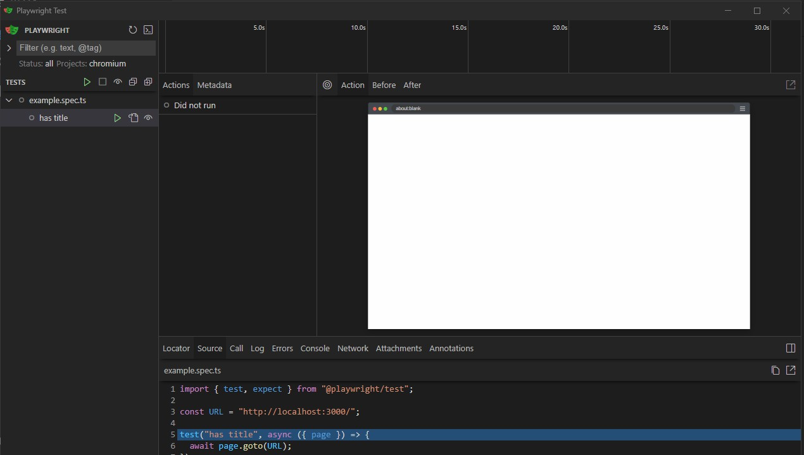
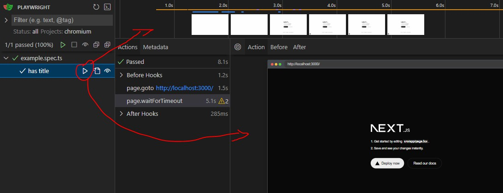
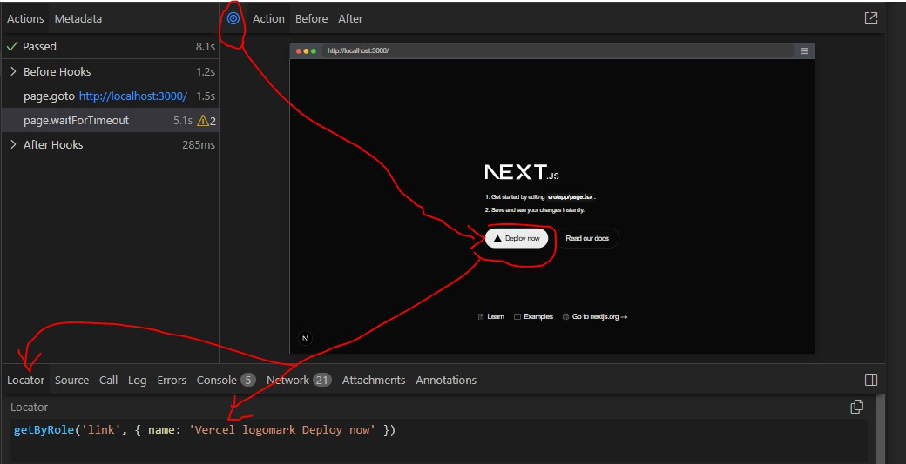

# general

Es para hacer test desde una perspectiva externa al objetivo (simular que somos un usuario real)

Tiene implementaciones en varios idiomas, pero nos vamos a centrar en typescript

# instalacion

Dentro de la carpeta del proyecto a probar /MiProyecto

```bash
pnpm create playwright
```

el va a instalarce con el node modules y va a crear una carpeta /tests y algunos archivos

Los archivos de test se van a inlcuir la terminacion `.spec.ts` ejemplo mi-test.spec.ts

# Ejecutar los test

```bash
pnpm exec playwright test
```

al final te redirige a una pestaña donde se ven los resultados `http://localhost:9323/`

## -g

filtra por los nombres de los test

```bash
pnpm exec playwright test -g "nombre del test"
```

## --ui

lanza el test pero mostrando informacion literalmente visual

```bash
npx playwright test --ui
```





# test

en los archivos `miPrueba.spect.ts` es necesario primero importar los elementos escenciales

```typescript
import { test, expect } from "@playwright/test";
import "dotenv/config"; // en caso de dotenv (recomendado)
```

un test individual se ejecuta dentro de una funcion `test` que toma dos argumentos, el titulo (string) del test y una funcion async cun un parametro `{ page }` que no retorna nada

```typescript
test("has title", async ({ page }) => { ... });
```

## page

representa a una pestaña del navegador

### goto

generalmente lo primero que se realiza en un test es ir a una direccion, y esto se hace a traves de la funcion `goto` de page que recibe una URL

```typescript
test("has title", async ({ page }) => {
  const EXPECTED_URL = process.env.EXPECTED_URL + "";

  await page.goto(EXPECTED_URL);
})
```

# Localizadores

son para obtener una manera de obtener los datos de un elmento para luego hacerle un test

Para obtenerlo se preciona sobre el boton (circulo) Pick Locator, y se lecciona el elmento a localizar (en este caso el boton blanco), luego en la pestaña de Locator sale el localizador de este elemento seleccionado



## id

```typescript
const email = page.locator("#id-input-email");
```

## link

por contenido de boton relacionado a un `<a>`

```typescript
const boton = page.getByRole("link", { name: "Ir A Otra" });
```

## button

por boton con contenido

```typescript
const boton = page.getByRole("button", { name: "Send" });
```

# Esperas

Cuando es necesario esperar hasta que se cumpla algo

## waitForSelector

A beses es necesario esperar por la carga de algunos elementos

```javascript
await a_Page.waitForSelector("text=Send");
```

## waitForTimeout

esperar por un tiempo en ml segundos

```javascript
await a_Page.waitForTimeout(6000);
```

## waitForURL

Esperar porque carga una URL, generalmente atado a algun
evento que provoca la carga de esta URL

```javascript
await Promise.all([
    a_Page.waitForURL(`${URL_1}/verificar`),
    a_Page.keyboard.press("Enter"),
  ]);
```

# Acciones

se pueden usar desde los localizadores o desde el page pasandelo como primer argumento los datos del localizador

## click

```typescript
selector_boton.click();

// usando el localizador (1er arg el localizador, en este caso 
// por contenid de texto)
await a_Page.click("text=Send");
```

## fill

En el caso de los `<input>` para ponerle valores

```typescript
selector_input_email.fill("micorreo@example.com");

// usando el localizador (1er arg el localizador, en este caso por #id)
await a_Page.fill("#id-input-email", "asd@asd.com");
```

## press

para simular la utilizacion del teclado

```typescript
// usando el localizador (1er arg el localizador, en este caso por #id)
await a_Page.press("#id-input-email", "Enter");
```

### keyboard

luego de usar algun evento como `fill `o `click `, se puede mandar a precionar una tecla usando `page.keyboard` (osea este paso no incluye volver a seleccionar un elemento, sino que en el elemento que este previamente selecciona aplicar la tecla)

```javascript
await a_Page.fill("#id-input-email", "asd@asd.com");

//luego de tener seleccionado el elemento
await a_Page.keyboard.press("Enter");
```

# expect

Es en encargado de realizar las evaluaciones, recibe como argumento, un elemento de la pagina (como un page, o un localizador), o otro tipo de objeto. Y según su argumento provee de una serie de métodos de evaluación

```typescript
test("has title", async ({ page }) => {
  const EXPECTED_URL = process.env.EXPECTED_URL + "";

  await page.goto(EXPECTED_URL);
  await a_Page.click("text=Send");

  await expect(page.url()).toBe(`${EXPECTED_URL}/form`);
})
```

## toBeVisible

Comprueba si el elemento es visible

```typescript
await expect(paginaSuccess.successMessage).toBeVisible();
```

## toBeNull

```typescript
await expect(code_mail).toBeNull();
```

# describe

Para agrupar test, dentro de el van los test y los hooks comunes 

```typescript
test.describe("conjunto de test", () => {
  test.beforeAll(async ({ browser }) => {});
  test.afterAll(async ({ browser }) => {});
  beforeEach(async () => {});
  afterEach(async () => {});
  test("mi prueba interna1", async ({ page }) => {});
  test("mi prueba interna2", async ({ page }) => {});
});
```

# only

en un archivo de pruebas, si hay varias, y hay alguno marcado con esto, entonces de este archivo solo se va a ejecutar la prueba esta

```typescript
import { test, expect } from "@playwright/test";
import "dotenv/config";

test.only("prueba1", async ({ page }) => {});
test("prueba2", async ({ page }) => {});
```

# skip

Las pruebas marcadas con este no se ejecutarn, tambien es valido para descrive

```typescript
import { test, expect } from "@playwright/test";
import "dotenv/config";

test.skip("prueba1", async ({ page }) => {});
test("prueba2", async ({ page }) => {});
test.describe.skip("conjunto de test2", () => {});
```

# describe.serial

las pruebas dentro de este grupo se ejecutaran en serie (no de forma asincorna) (osea en orden, supongo que comenzando con la que mas arriba [cerca de la linea 0] este)

```typescript
test.describe.serial("conjunto de test2", () => {});
```

# Simular click (con class)

1- Vamos a almacenar los elementos comunes en una clase

/pages/PaginaAGuardar.ts

```typescript
import { Page, Locator } from "@playwright/test";

export default class PaginaAGuardar {
  readonly page: Page;
  readonly botonDeIr: Locator;
  constructor(page: Page) {
    this.page = page;
    this.botonDeIr = page.getByRole("link", { name: "Ir A Otra" });
  }
}
```

2- creamos el test

/test/mi-test.spec.ts

```typescript
import { test, expect } from "@playwright/test";

const URL = "http://localhost:3000/";
import PaginaAGuardar from "../pages/PaginaAGuardar";
let pagina: PaginaAGuardar;
test("move to page", async ({ page }) => {
  pagina = new PaginaAGuardar(page);
  await page.goto(URL);
  await paginaLanding.botonDeIr.click();
  await page.waitForTimeout(5000);
  expect(page.url()).toBe(`${URL}otra`);
});
```

al correr el test con --ui se ve como clickea sobre el boton y se ve la siguiente pagina. Si el boton no hubiese existido daria error con el test fallido

# Multiples paginas

se decalran todas al principio, (en este ejemplo como next se tarda en compilar pusimos entre todos los saltos un espera de 5s)

```typescript
import { test, expect } from "@playwright/test";

import PaginaLanding from "../pages/PaginaLanding";
import PaginaSendEmail from "../pages/PaginaSendEmail";
import PaginaSuccess from "../pages/PaginaSuccess";

const URL = "http://localhost:3000/";
let paginaLanding: PaginaLanding;
let paginaForm: PaginaSendEmail;
let paginaSuccess: PaginaSuccess;
test("sen email", async ({ page }) => {
  paginaLanding = new PaginaLanding(page);
  paginaForm = new PaginaSendEmail(page);
  paginaSuccess = new PaginaSuccess(page);
  await page.goto(URL);
  await paginaLanding.botonDeForm.click();
  await page.waitForTimeout(5000);
  expect(page.url()).toBe(`${URL}form`);
  await paginaForm.inputemail.fill("asd@asd.com");
  await paginaForm.botonSendEmail.click();
  await page.waitForTimeout(5000);
  expect(page.url()).toBe(`${URL}success`);
  expect(paginaSuccess.successMessage).toBeVisible();
});
```

# .env

si vas a usar variables de entorno en tus test, asegurate de tener instalado `dotenv`

```bash
pnpm install dotenv
```

y luego donde se vayan a usar las variables de entorno 

```typescript
import "dotenv/config";
test("has title", async ({ page }) => {
  const EXPECTED_URL = process.env.EXPECTED_URL + "";
  ...
}
```

# javascript

## Ejemplo Abrir y Cerrar navegador

Se puede usar para abrir una pestaña de un sitio web (obviamente este es el primer paso y lo siguiente es interactuar)

```bash
npx tsx  .\example\contexto_paginas.js
```

```javascript
const { chromium } = require("playwright");
URL_GOOGLE = "https://www.google.com";
URL_1 = "http://localhost:3000";
(async () => {
  const browser = await chromium.launch({ headless: false });
  //contexto google
  const googleContext = await browser.newContext();
  const googlePage = await googleContext.newPage();
  await googlePage.goto(URL_1);
  await googlePage.waitForTimeout(6000);
  console.log("contexto1 de google open");
  await browser.close();
})();
```

### multiple

```javascript
const { chromium } = require("playwright");
URL_GOOGLE = "https://www.google.com";
URL_1 = "http://localhost:3000";
URL_2 = `${URL_1}/form`;
(async () => {
  const browser = await chromium.launch({ headless: false });
  //contexto google
  const googleContext = await browser.newContext();
  const googlePage = await googleContext.newPage();
  await googlePage.goto(URL_1);
  await googlePage.waitForTimeout(6000);
  console.log("contexto1 de google open");

  //contexo wiki
  const wikipediaContext = await browser.newContext();
  const wikipediaPage = await wikipediaContext.newPage();
  await wikipediaPage.goto(URL_2);
  await wikipediaPage.waitForTimeout(6000);
  console.log("contexto1 de wikipedia open");

  await browser.close();
})();
```

# playwright.config.ts

almacena la configuracion, principalmente dentro del argumento metodo  `defineConfig` 

```typescript
import { defineConfig, devices } from "@playwright/test";


export default defineConfig({
  timeout: 90_000,
  testDir: "./tests",
  /* Run tests in files in parallel */
  fullyParallel: true,
    ......
  });
```

## fullyParallel

si es verdadero los test se ejecutan en paralelo 

## retries

cantidad de intentos para pruebas fallidas

El valor que se ve indica que en Integracion continua reintenta la prueba fallida 2 veces 

```typescript
export default defineConfig({
    retries: process.env.CI ? 2 : 0,
});
```

## workers

cantidad de workes, la configuracion que se ve indica que en CI seria 1, pero en local al ser undefined significa que segun el harware va a decidir la cantidad

```typescript
export default defineConfig({
    workers: process.env.CI ? 1 : undefined,
});
```

## webServer

Para cuando esta integrado directamente con un proyecto node (osea en el mismo directorio se encuentra esto de playwright y a la ves el proyecto que tal ves sea de react, vue o otro)

Esta configuracion por defecto esta comentada

```typescript
export default defineConfig({
    webServer: {
        command: 'npm run start',
        url: 'http://localhost:3000',
        reuseExistingServer: !process.env.CI,            
      },
});
```

## timeout

Para configurar el tiempo maximo del que dispone un prueba, por defecto son 30 segundos y esta propiedad no esta por defecto en la configuracion (si no esta se asume los 30s)

```typescript
export default defineConfig({
    timeout: 90_000,
});
```

# POM

Aquí tienes una explicación detallada sobre el **Page Object Model (POM)** en Playwright usando TypeScript, junto con ejemplos y buenas prácticas para implementarlo. Esta información te ayudará a crear una guía completa sobre Playwright.

---

## ¿Qué es el Page Object Model (POM)?

El **Page Object Model (POM)** es un patrón de diseño utilizado en pruebas automatizadas para representar las páginas web de una aplicación como objetos. Cada página se modela como una clase que contiene:

- **Selectores** de los elementos de la página (como campos de texto, botones, etc.).
- **Métodos** que realizan acciones en la página (como hacer clic en un botón o llenar un formulario).

Este enfoque mejora la **legibilidad**, **reutilización** y **mantenimiento** de las pruebas, ya que separa la lógica de la interfaz de usuario de la lógica de las pruebas.

---

## Fundamentos del POM en Playwright con TypeScript

En Playwright, el POM se implementa creando clases para cada página de la aplicación. Cada clase:

- Recibe una instancia de `Page` (de Playwright) en su constructor.
- Define los **selectores** de los elementos clave de la página.
- Proporciona **métodos** para interactuar con esos elementos.

Esto permite que las pruebas se centren en la lógica de negocio en lugar de en los detalles de la interfaz.

---

## Ejemplo básico de POM

Supongamos que tienes una página de inicio de sesión con campos para usuario, contraseña y un botón de inicio de sesión. Aquí te muestro cómo crear una clase `LoginPage` para esta página.

```typescript
import { Page } from '@playwright/test';

export class LoginPage {
  readonly page: Page;
  readonly usernameInput = '#username';  // Selector del campo de usuario
  readonly passwordInput = '#password';  // Selector del campo de contraseña
  readonly loginButton = '#login';       // Selector del botón de inicio de sesión

  constructor(page: Page) {
    this.page = page;
  }

  async login(username: string, password: string) {
    await this.page.fill(this.usernameInput, username);
    await this.page.fill(this.passwordInput, password);
    await this.page.click(this.loginButton);
  }
}
```

**Explicación**:

- La clase `LoginPage` recibe una instancia de `Page` en su constructor.
- Define los selectores de los elementos clave (usuario, contraseña y botón).
- El método `login` encapsula la lógica para llenar los campos y hacer clic en el botón.

## Selectores como objetos en atributos

los atributos de selectores almacenarlos como `page.locator`

```typescript
// pages/login.page.ts
import { Page } from '@playwright/test';

export class LoginPage {
  readonly page: Page;
  readonly usernameInput = this.page.locator('#username');
  readonly passwordInput = this.page.locator('#password');
  readonly loginButton = this.page.locator('#loginBtn');

  constructor(page: Page) {
    this.page = page;
  }

  async goto() {
    await this.page.goto('https://example.com/login'); 
  }

  async login(username: string, password: string) {
    await this.usernameInput.fill(username);
    await this.passwordInput.fill(password);
    await this.loginButton.click();
  }
}
```

## selectores en constructor

pasar la incializacion de los selectores al constructor de la clase

```typescript
// pages/loginPage.ts

import { type Locator, type Page } from '@playwright/test';

export class LoginPage {
  // Propiedades de la clase
  readonly page: Page;
  readonly usernameInput: Locator;
  readonly passwordInput: Locator;
  readonly loginButton: Locator;

  // Constructor para inicializar la página y los selectores
  constructor(page: Page) {
    this.page = page;
    this.usernameInput = page.locator('#username'); // Selector por ID
    this.passwordInput = page.locator('#password');
    this.loginButton = page.locator('button[type="submit"]'); // Selector de CSS
  }

  // Método para realizar la acción de login
  async login(username: string, password?: string) {
    await this.usernameInput.fill(username);
    if (password) {
      await this.passwordInput.fill(password);
    }
    await this.loginButton.click();
  }

  // Método para navegar a la página
  async goto() {
    await this.page.goto('https://tu-sitio-web.com/login');
  }
}
```

---

## Cómo usar la clase POM en una prueba

Una vez que tienes la clase `LoginPage`, puedes usarla en tus pruebas de la siguiente manera:

```typescript
import { test, expect } from '@playwright/test';
import { LoginPage } from './LoginPage';

test('iniciar sesión', async ({ page }) => {
  const loginPage = new LoginPage(page);
  await loginPage.login('usuario', 'contraseña');
  // Aquí puedes agregar aserciones para verificar que el inicio de sesión fue exitoso
});
```

**Ventajas**:

- La prueba es más legible y concisa.
- Si los selectores cambian (por ejemplo, si el ID del campo de usuario cambia), solo necesitas actualizar la clase `LoginPage`, no cada prueba que use ese selector.

---

## Buenas prácticas para implementar POM en Playwright

1. **Usa selectores únicos y estables**:
   
   - Prefiere selectores como IDs (`#id`), data attributes (`[data-test="element"]`), o clases específicas.
   - Evita selectores CSS complejos o basados en texto, ya que pueden cambiar fácilmente.

2. **Encapsula la lógica de interacción**:
   
   - Los métodos de la clase POM deben manejar todas las interacciones con la página.
   - Las pruebas solo deben llamar a estos métodos, no interactuar directamente con los selectores.
   
   **Ejemplo**:
   
   - En lugar de:
     
     ```typescript
     await page.fill('#username', 'usuario');
     await page.fill('#password', 'contraseña');
     await page.click('#login');
     ```
   
   - Usa:
     
     ```typescript
     await loginPage.login('usuario', 'contraseña');
     ```

3. **Organiza las clases POM en archivos separados**:
   
   - Crea una carpeta `pages` y coloca cada clase POM en su propio archivo (por ejemplo, `loginPage.ts`, `homePage.ts`).
   - Esto mantiene el código organizado y fácil de mantener.

4. **Usa una clase base para funcionalidad común**:
   
   - Si varias páginas comparten métodos o propiedades, crea una clase `BasePage` que puedan extender.
   - Por ejemplo, un método para navegar a la página.
   
   **Ejemplo de `BasePage`**:
   
   ```typescript
   import { Page } from '@playwright/test';
   
   export class BasePage {
     readonly page: Page;
     readonly url: string;
   
     constructor(page: Page, url: string) {
       this.page = page;
       this.url = url;
     }
   
     async navigate() {
       await this.page.goto(this.url);
     }
   }
   ```
   
   **Extender `BasePage` en `LoginPage`**:
   
   ```typescript
   import { BasePage } from './BasePage';
   
   export class LoginPage extends BasePage {
     readonly usernameInput = '#username';
     readonly passwordInput = '#password';
     readonly loginButton = '#login';
   
     constructor(page: Page) {
       super(page, 'https://ejemplo.com/login');
     }
   
     async login(username: string, password: string) {
       await this.page.fill(this.usernameInput, username);
       await this.page.fill(this.passwordInput, password);
       await this.page.click(this.loginButton);
     }
   }
   ```
   
   - Ahora puedes navegar a la página antes de iniciar sesión:
     
     ```typescript
     await loginPage.navigate();
     await loginPage.login('usuario', 'contraseña');
     ```

5. **Maneja elementos dinámicos**:
   
   - Si los elementos no están disponibles inmediatamente (por ejemplo, después de una carga asíncrona), usa métodos como `waitForSelector` para asegurarte de que estén presentes antes de interactuar con ellos.
   
   **Ejemplo**:
   
   ```typescript
   async waitForLoginButton() {
     await this.page.waitForSelector(this.loginButton);
   }
   ```

6. **Agrupa acciones relacionadas**:
   
   - Si una página tiene secciones complejas (como formularios o menús), puedes crear métodos que manejen toda la lógica de esa sección.
   
   **Ejemplo**:
   
   - Un método `fillForm` que llene varios campos de un formulario y luego haga clic en "Enviar".

7. **Evita duplicar código**:
   
   - Si varias páginas tienen elementos o comportamientos similares, considera crear métodos reutilizables en la clase base o en utilidades separadas.

#### **Estructura de Archivos**

Una estructura de proyecto común podría verse así:

```
/
|-- tests/
|   |-- example.spec.ts   // Nuestro archivo de prueba
|-- pages/
|   |-- loginPage.ts      // Nuestro Page Object para la página de login
|-- playwright.config.ts
|-- package.json
```

o asi

```
project/
├── pages/          # Clases de POM
│   ├── base.page.ts
│   ├── login.page.ts
│   └── dashboard.page.ts
├── tests/          # Archivos de prueba
│   └── login.spec.ts
├── utils/          # Funciones auxiliares (opcional)
└── playwright.config.ts
```

---

## Ejemplo avanzado: POM con múltiples páginas

Supongamos que después de iniciar sesión, el usuario es redirigido a una página de inicio (`HomePage`). Aquí te muestro cómo podrías modelar eso.

**Clase `HomePage`**:

```typescript
import { Page } from '@playwright/test';

export class HomePage {
  readonly page: Page;
  readonly welcomeMessage = '#welcome';

  constructor(page: Page) {
    this.page = page;
  }

  async getWelcomeMessage() {
    return await this.page.textContent(this.welcomeMessage);
  }
}
```

**Prueba que usa ambas páginas**:

```typescript
import { test, expect } from '@playwright/test';
import { LoginPage } from './LoginPage';
import { HomePage } from './HomePage';

test('iniciar sesión y verificar mensaje de bienvenida', async ({ page }) => {
  const loginPage = new LoginPage(page);
  await loginPage.navigate();
  await loginPage.login('usuario', 'contraseña');

  const homePage = new HomePage(page);
  const message = await homePage.getWelcomeMessage();
  expect(message).toBe('Bienvenido, usuario');
});
```

**Explicación**:

- Después de iniciar sesión, la prueba usa la clase `HomePage` para interactuar con la página de inicio.
- Esto mantiene las pruebas organizadas y enfocadas en la lógica de alto nivel.

# Screenplay

---

## ¿Qué es el patrón Screenplay?

El **patrón Screenplay** es un enfoque de diseño para pruebas automatizadas que modela las interacciones del usuario como una serie de acciones realizadas por "actores". En lugar de centrarse en la estructura técnica de la interfaz de usuario (como hace el POM), Screenplay se enfoca en las intenciones y comportamientos del usuario. Esto lo hace particularmente útil en contextos de **desarrollo impulsado por comportamiento (BDD)**, ya que alinea las pruebas con las historias de usuario y los objetivos de negocio.

Piensa en Screenplay como un guion de película: los actores realizan tareas y acciones específicas para avanzar en la historia, y pueden hacer preguntas para verificar el estado de la escena (la aplicación).

---

## Componentes clave del patrón Screenplay

El patrón Screenplay se construye alrededor de los siguientes conceptos fundamentales:

1. **Actores (Actors)**:
   
   - Representan a los usuarios o roles que interactúan con el sistema.
   - Cada actor tiene **habilidades** que le permiten realizar ciertas actividades, como navegar por la web o interactuar con una base de datos.

2. **Habilidades (Abilities)**:
   
   - Son las capacidades que un actor posee. Por ejemplo, la habilidad de usar un navegador web o hacer una llamada a una API.

3. **Tareas (Tasks)**:
   
   - Son actividades de alto nivel que el actor realiza para alcanzar un objetivo, como "iniciar sesión" o "completar un formulario".
   - Las tareas están compuestas por acciones más pequeñas.

4. **Acciones (Actions)**:
   
   - Son los pasos individuales dentro de una tarea, como hacer clic en un botón, ingresar texto en un campo o seleccionar una opción.

5. **Preguntas (Questions)**:
   
   - Permiten a los actores obtener información sobre el estado de la aplicación, como verificar si un elemento está visible o leer el texto de un mensaje.

---

## Diferencias entre Screenplay y POM

Para entender mejor Screenplay, es útil compararlo con el **Page Object Model (POM)**:

- **POM**:
  
  - Se enfoca en modelar la estructura de la interfaz de usuario.
  - Cada página de la aplicación se representa como un objeto con métodos que interactúan con los elementos (por ejemplo, `clickLoginButton` o `enterUsername`).
  - Es más técnico y está ligado a los detalles de la UI.

- **Screenplay**:
  
  - Se enfoca en el comportamiento del usuario y sus objetivos.
  - Las pruebas se escriben en términos de "qué" quiere lograr el usuario, no "cómo" está estructurada la interfaz.
  - Es más resiliente a cambios en la UI, ya que las acciones y tareas están desacopladas de los selectores específicos.

---

## Ejemplo práctico en Playwright con TypeScript

Veamos cómo se aplica el patrón Screenplay en un escenario simple de inicio de sesión usando **Playwright** y **TypeScript**. Este ejemplo te ayudará a visualizar cómo se combinan los componentes.

### 1. Definir la habilidad (Ability)

Primero, creamos una habilidad que permite al actor interactuar con la web usando Playwright:

```typescript
import { Page } from '@playwright/test';

export class BrowseTheWeb {
  constructor(private page: Page) {}

  async goto(url: string) {
    await this.page.goto(url);
  }

  async fill(selector: string, value: string) {
    await this.page.fill(selector, value);
  }

  async click(selector: string) {
    await this.page.click(selector);
  }

  async textContent(selector: string) {
    return await this.page.textContent(selector);
  }
}
```

### 2. Definir acciones (Actions)

Las acciones son los pasos individuales que el actor puede realizar:

```typescript
export class EnterText {
  static async into(selector: string, value: string) {
    return async (actor: Actor) => {
      const browse = actor.abilityTo(BrowseTheWeb);
      await browse.fill(selector, value);
    };
  }
}

export class ClickElement {
  static async on(selector: string) {
    return async (actor: Actor) => {
      const browse = actor.abilityTo(BrowseTheWeb);
      await browse.click(selector);
    };
  }
}
```

### 3. Definir una tarea (Task)

La tarea agrupa acciones para representar un comportamiento completo, como "iniciar sesión":

```typescript
export class Login {
  static async with(username: string, password: string) {
    return async (actor: Actor) => {
      await actor.attemptsTo(
        EnterText.into('#username', username),
        EnterText.into('#password', password),
        ClickElement.on('#login')
      );
    };
  }
}
```

### 4. Definir una pregunta (Question)

Las preguntas verifican el estado de la aplicación:

```typescript
export class IsLoggedIn {
  static async check() {
    return async (actor: Actor) => {
      const browse = actor.abilityTo(BrowseTheWeb);
      const message = await browse.textContent('#welcome');
      return message.includes('Bienvenido');
    };
  }
}
```

### 5. Definir el actor (Actor)

El actor es quien ejecuta las tareas y hace las preguntas:

```typescript
export class Actor {
  private abilities: Map<string, any> = new Map();

  constructor(private name: string) {}

  can(ability: any) {
    this.abilities.set(ability.constructor.name, ability);
    return this;
  }

  abilityTo<T>(abilityType: new (...args: any[]) => T): T {
    return this.abilities.get(abilityType.name);
  }

  async attemptsTo(...tasks: Array<() => Promise<void>>) {
    for (const task of tasks) {
      await task(this);
    }
  }

  async asks(question: () => Promise<any>) {
    return await question(this);
  }
}
```

### 6. Escribir la prueba

Finalmente, usamos el actor en una prueba:

```typescript
import { test, expect } from '@playwright/test';
import { Actor } from './Actor';
import { BrowseTheWeb } from './BrowseTheWeb';
import { Login } from './Login';
import { IsLoggedIn } from './IsLoggedIn';

test('iniciar sesión con Screenplay', async ({ page }) => {
  const actor = new Actor('Usuario');
  actor.can(new BrowseTheWeb(page));

  await actor.attemptsTo(
    async (a) => await a.abilityTo(BrowseTheWeb).goto('https://ejemplo.com/login'),
    Login.with('usuario', 'contraseña')
  );

  const isLoggedIn = await actor.asks(IsLoggedIn.check());
  expect(isLoggedIn).toBe(true);
});
```

**Explicación del flujo**:

- El actor "Usuario" tiene la habilidad de navegar por la web con Playwright.
- Ejecuta la tarea de "iniciar sesión" ingresando un usuario y contraseña, y haciendo clic en el botón de login.
- Luego, pregunta si el inicio de sesión fue exitoso verificando un mensaje de bienvenida.

---

## Ventajas del patrón Screenplay

- **Legibilidad**: Las pruebas se leen como un guion, describiendo claramente las intenciones del usuario.
- **Reutilización**: Las tareas y acciones son módulos reutilizables en diferentes pruebas.
- **Resiliencia**: Al enfocarse en el comportamiento y no en la estructura de la UI, las pruebas son menos propensas a romperse por cambios en la interfaz.
- **Mantenibilidad**: Los cambios en la UI solo afectan a las acciones específicas, no a todas las pruebas.

---

## Consideraciones

Aunque Screenplay puede ser más verboso que el POM y requiere un poco más de configuración inicial, sus beneficios brillan en proyectos complejos o equipos que buscan alinear las pruebas con los requisitos del negocio. Es una excelente opción si trabajas con BDD o necesitas pruebas que sean fáciles de entender para stakeholders no técnicos.

---

## Estructura de archivos recomendada para el patrón Screenplay

El patrón Screenplay se basa en componentes clave: **actores**, **habilidades**, **tareas**, **acciones** y **preguntas**. Cada uno de estos debe tener su propio lugar en la estructura de archivos para facilitar la navegación y el mantenimiento. A continuación, te propongo una estructura que sigue las mejores prácticas y es adaptable a diferentes tamaños de proyecto.

### Estructura básica

```
project-root/
├── actors/
│   └── Actor.ts
├── abilities/
│   └── BrowseTheWeb.ts
├── tasks/
│   ├── Login.ts
│   ├── AddToCart.ts
│   └── ...
├── actions/
│   ├── EnterText.ts
│   ├── ClickElement.ts
│   └── ...
├── questions/
│   ├── IsLoggedIn.ts
│   ├── CartItemCount.ts
│   └── ...
├── tests/
│   ├── login.test.ts
│   ├── shopping.test.ts
│   └── ...
├── utils/
│   ├── config.ts
│   ├── helpers.ts
│   └── ...
└── README.md
```

### Explicación de cada carpeta

1. **`actors/`**  
   
   - Contiene la definición del actor o actores. Normalmente, un solo archivo como `Actor.ts` es suficiente, ya que los actores suelen ser genéricos y reutilizables.  
   - Si tu proyecto tiene diferentes tipos de usuarios (por ejemplo, "admin" o "cliente"), podrías agregar subclases específicas aquí.

2. **`abilities/`**  
   
   - Aquí se definen las habilidades de los actores, como `BrowseTheWeb.ts`, que permite interactuar con una página web usando Playwright.  
   - Si necesitas habilidades adicionales (por ejemplo, interactuar con una API), también se colocan en esta carpeta.

3. **`tasks/`**  
   
   - Contiene las tareas de alto nivel que los actores realizan, como "iniciar sesión" (`Login.ts`) o "agregar al carrito" (`AddToCart.ts`).  
   
   - Cada tarea agrupa varias acciones para lograr un objetivo específico.  
   
   - En proyectos grandes, puedes organizar las tareas en subcarpetas por funcionalidad:  
     
     ```
     tasks/
     ├── authentication/
     │   └── Login.ts
     ├── shopping/
     │   └── AddToCart.ts
     └── ...
     ```

4. **`actions/`**  
   
   - Define las acciones individuales y más básicas, como `EnterText.ts` o `ClickElement.ts`.  
   
   - Si hay muchas acciones, puedes dividirlas en subcarpetas según su tipo o propósito:  
     
     ```
     actions/
     ├── form/
     │   ├── EnterText.ts
     │   └── SelectOption.ts
     ├── navigation/
     │   └── ClickLink.ts
     └── ...
     ```

5. **`questions/`**  
   
   - Almacena las preguntas que los actores pueden hacer para verificar el estado de la aplicación, como `IsLoggedIn.ts` o `CartItemCount.ts`.  
   - Estas se usan en las aserciones de las pruebas.

6. **`tests/`**  
   
   - Contiene los archivos de prueba, como `login.test.ts` o `shopping.test.ts`.  
   - Aquí se combinan actores, tareas y preguntas para definir los escenarios de prueba.  
   - En proyectos grandes, puedes organizarlos en subcarpetas por funcionalidad o suite de pruebas.

7. **`utils/`**  
   
   - Incluye archivos de utilidades generales, como configuraciones (`config.ts`), funciones de ayuda (`helpers.ts`) o datos de prueba.  
   - Es opcional, pero ayuda a mantener el código limpio y evitar duplicación.

8. **`README.md`**  
   
   - Un archivo en la raíz del proyecto que explica la estructura y cómo usarla. Es muy útil para nuevos miembros del equipo.

---

## Buenas prácticas para la estructura de archivos

1. **Separación clara por tipo de componente**  
   
   - Mantén cada elemento del patrón Screenplay (actores, habilidades, tareas, etc.) en su propia carpeta para facilitar la búsqueda y edición del código.

2. **Organización por funcionalidad**  
   
   - Si tu aplicación tiene módulos como autenticación, compras o perfil, usa subcarpetas dentro de `tasks`, `actions` y `questions` para reflejar estas áreas:  
     
     ```
     tasks/
     ├── authentication/
     │   ├── Login.ts
     │   └── Logout.ts
     ├── shopping/
     │   ├── AddToCart.ts
     │   └── Checkout.ts
     └── ...
     ```

3. **Nombres descriptivos y consistentes**  
   
   - Usa nombres que indiquen claramente el propósito del archivo, como `Login.ts` o `ClickElement.ts`.  
   - Sigue una convención consistente, por ejemplo, PascalCase para clases (`LoginTask`) y camelCase para funciones.

4. **Evita duplicación de código**  
   
   - Si varias tareas o acciones comparten lógica, extráela a archivos en `utils/` o crea acciones reutilizables.

5. **Documentación**  
   
   - Agrega comentarios en el código para explicar tareas o acciones complejas.  
   - Incluye un `README.md` con detalles sobre la estructura y las convenciones.

6. **Escalabilidad**  
   
   - Revisa y ajusta la estructura a medida que el proyecto crece. Si una carpeta tiene demasiados archivos, considera subdividirla.  
   - Diseña la estructura para que sea flexible ante nuevos requerimientos.

---

## Ejemplo para un proyecto pequeño

Para un proyecto pequeño, esta estructura básica funciona bien:

```
project-root/
├── actors/
│   └── Actor.ts
├── abilities/
│   └── BrowseTheWeb.ts
├── tasks/
│   ├── Login.ts
│   └── SearchProduct.ts
├── actions/
│   ├── EnterText.ts
│   ├── ClickElement.ts
│   └── SelectOption.ts
├── questions/
│   ├── IsLoggedIn.ts
│   └── ProductDetails.ts
├── tests/
│   ├── login.test.ts
│   └── search.test.ts
└── utils/
    └── config.ts
```

## Ejemplo para un proyecto grande

Para un proyecto más complejo con múltiples módulos, la estructura puede expandirse así:

```
project-root/
├── actors/
│   └── Actor.ts
├── abilities/
│   ├── BrowseTheWeb.ts
│   └── CallAPI.ts
├── tasks/
│   ├── authentication/
│   │   ├── Login.ts
│   │   └── Register.ts
│   ├── shopping/
│   │   ├── AddToCart.ts
│   │   └── Checkout.ts
│   └── profile/
│       └── UpdateProfile.ts
├── actions/
│   ├── form/
│   │   ├── EnterText.ts
│   │   └── SelectOption.ts
│   ├── navigation/
│   │   └── ClickLink.ts
│   └── api/
│       └── SendRequest.ts
├── questions/
│   ├── authentication/
│   │   └── IsLoggedIn.ts
│   ├── shopping/
│   │   └── CartItemCount.ts
│   └── profile/
│       └── ProfileInfo.ts
├── tests/
│   ├── authentication/
│   │   ├── login.test.ts
│   │   └── register.test.ts
│   ├── shopping/
│   │   ├── addToCart.test.ts
│   │   └── checkout.test.ts
│   └── profile/
│       └── updateProfile.test.ts
└── utils/
    ├── config.ts
    ├── helpers.ts
    └── testData.ts
```


## Ejemplo


## /tasks/


### /tasks/task.ts

```typescript
import { Page } from "@playwright/test";

export interface Task {
  perform(page?: Page): Promise<void>;
}

```

### /tasks/openBrowser.ts

```typescript
import { Browser, Page, chromium } from "@playwright/test";
import { Task } from "./task";

export default class OpenBrowser implements Task {
  private url: string;
  private browser?: Browser;
  private page?: Page;
  constructor(url: string) {
    this.url = url;
  }
  static at(url: string): OpenBrowser {
    return new OpenBrowser(url);
  }
  async perform(): Promise<void> {
    this.browser = await chromium.launch({ headless: false });
    const context = await this.browser.newContext();
    this.page = await context.newPage();
    await this.page.goto(this.url);
  }
  async close(): Promise<void> {
    if (this.browser) {
      await this.browser.close();
    }
  }
  getPage(): Page | undefined {
    return this.page;
  }
}

```


### /tasks/senEmail.ts


```typescript
import { Browser, Page, chromium } from "@playwright/test";
import { Task } from "./task";

export default class SendEmail implements Task {
  private email: string;
  constructor(email: string) {
    this.email = email;
  }
  static for(email: string): SendEmail {
    return new SendEmail(email);
  }
  async perform(page?: Page): Promise<void> {
    if (!page) {
      throw new Error("No esta inicializada");
    }
    await page.fill("#id-input-email", "asd@asd.com");
    await page.press("#id-input-email", "Enter");
  }
}

```


### /tasks/sendCode.ts

```typescript
import { Browser, Page, chromium } from "@playwright/test";
import { Task } from "./task";

export default class SendCode implements Task {
  private code: string;
  constructor(code: string) {
    this.code = code;
  }
  static for(code: string): SendCode {
    return new SendCode(code);
  }
  async perform(page?: Page): Promise<void> {
    if (!page) {
      throw new Error("No esta inicializada");
    }
    const code = this.code;
    await page.fill("#id-digit-0", code[0]);
    await page.fill("#id-digit-1", code[1]);
    await page.fill("#id-digit-2", code[2]);
    await page.fill("#id-digit-3", code[3]);
    await page.fill("#id-digit-4", code[4]);
    await page.fill("#id-digit-5", code[5]);
    await page.click("text=Send");
  }
}

```


## /actors/actor.ts

```typescript
// import { chromium, Browser, Page } from "playwright";
import { Page, Locator, chromium, Browser } from "@playwright/test";
import { Task } from "../tasks/task";
export default class Actor {
  name: string;
  private page?: Page;
  constructor(name: string) {
    this.name = name;
  }

  async attempsTo(...tasks: Task[]) {
    for (const task of tasks) {
      await task.perform(this.page);
    }
  }
  setPage(page: Page | undefined) {
    this.page = page;
  }
}

```


## /questions/verifySuccess.ts

```typescript
import { Browser, Page, chromium, expect } from "@playwright/test";
export default class VerifySuccess {
  static areDisplayed(): VerifySuccess {
    return new VerifySuccess();
  }
  async perform(page?: Page): Promise<boolean> {
    if (!page) {
      throw new Error("el page no esta definido");
    }
    const successMessage = page.getByText("Success");

    // await expect(successMessage).toBeVisible();
    return await successMessage.isVisible();
  }
}

```


## tests

```typescript
import { test, expect } from "@playwright/test";
import "dotenv/config";
import Actor from "../screenplay/actors/actor";
import OpenBrowser from "../screenplay/tasks/openBrowser";
import SendEmail from "../screenplay/tasks/senEmail";
import SendCode from "../screenplay/tasks/sendCode";
import VerifySuccess from "../screenplay/questions/verifySuccess";

test("test con screenplay", async ({ page }) => {
  const EXPECTED_URL = process.env.EXPECTED_URL + "";
  const actor = new Actor("Actor 1");
  const openForm = OpenBrowser.at(`${EXPECTED_URL}form`);
  await openForm.perform();
  actor.setPage(openForm.getPage());

  const sendEmail = SendEmail.for("asd@asd.com");
  await actor.attempsTo(sendEmail);

  const sendCode = SendCode.for("123456");
  await actor.attempsTo(sendCode);

  const verify = VerifySuccess.areDisplayed();

  await openForm.close();
});

```
